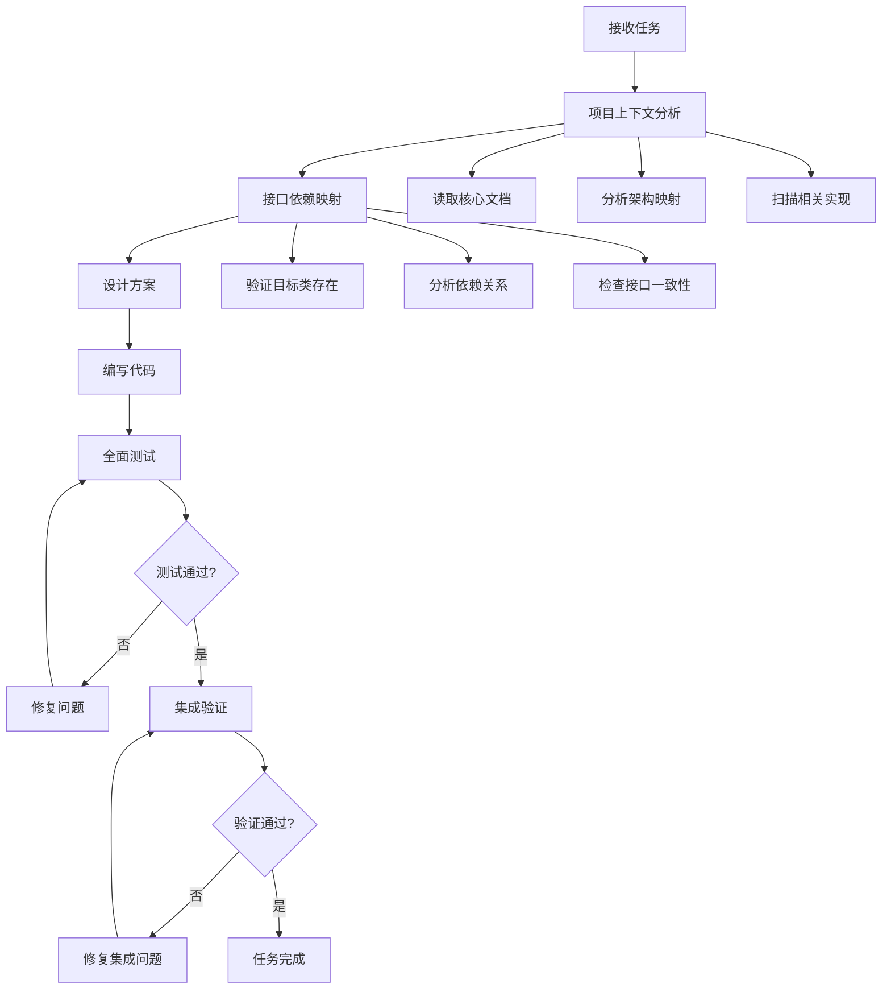

# 任务完成质量保证规则

## 🚨 强制性规则

### 规则1：测试驱动的任务完成

**任何任务在声称完成之前，必须通过以下验证：**

1. **代码能正常运行**：所有import语句成功，无语法错误
2. **依赖关系完整**：所有调用的方法和属性都存在
3. **集成测试通过**：组件间协作正常
4. **文档可执行**：按照文档能成功复现功能

### 规则2：零容忍错误类型

以下错误类型表示任务未完成，必须修复：

- `ImportError`: 导入错误
- `AttributeError`: 属性不存在错误  
- `TypeError`: 类型错误（如参数不匹配）
- `NameError`: 名称未定义错误

### 规则3：任务完成五步验证法

```
步骤1: 项目上下文分析 → 步骤2: 接口依赖映射 → 步骤3: 编写代码 → 步骤4: 全面测试 → 步骤5: 验证通过 → 任务完成
```

**绝不允许跳过任何步骤，特别是步骤1和步骤2**

## 🔧 技术实施要求

### 步骤1：项目上下文分析（必须执行）

```python
# 必须阅读的核心文档
REQUIRED_DOCS = [
    "PROJECT_SUMMARY.md",           # 项目整体概述
    "IMPLEMENTATION_SUMMARY.md",    # 实现状态总结
    "architecture_map.json",        # 完整架构映射
    "interface_map.json",          # 接口依赖映射
    "STANDARD_WORKFLOW.md"         # 标准工作流程
]

# 执行项目扫描
def analyze_project_context(task_description: str):
    """分析项目上下文，确保充分理解现有实现"""
    context = {}
    
    # 1. 读取核心文档
    for doc in REQUIRED_DOCS:
        context[doc] = read_document(doc)
    
    # 2. 扫描相关模块
    related_modules = find_related_modules(task_description)
    context['related_modules'] = related_modules
    
    # 3. 识别现有实现
    existing_implementations = scan_existing_implementations(task_description)
    context['existing_implementations'] = existing_implementations
    
    return context
```

### 步骤2：接口依赖映射（必须执行）

```python
# 基于architecture_map.json和interface_map.json进行依赖分析
def map_interface_dependencies(target_classes: List[str]):
    """映射接口依赖关系，确保所有依赖都存在"""
    
    # 1. 加载架构映射
    with open('architecture_map.json') as f:
        arch_map = json.load(f)
    
    with open('interface_map.json') as f:
        interface_map = json.load(f)
    
    # 2. 验证目标类存在
    missing_classes = []
    for cls in target_classes:
        if cls not in interface_map['available_classes']:
            missing_classes.append(cls)
    
    if missing_classes:
        raise ValueError(f"缺少必需的类: {missing_classes}")
    
    # 3. 分析依赖关系
    dependencies = {}
    for cls in target_classes:
        cls_info = interface_map['available_classes'][cls]
        module_info = arch_map['modules'][cls_info['module']]
        dependencies[cls] = {
            'module': cls_info['module'],
            'file': cls_info['file'],
            'imports': module_info['imports'],
            'methods': get_class_methods(cls_info),
            'required_attributes': extract_required_attributes(cls_info)
        }
    
    return dependencies
```

### 步骤3：代码质量检查（增强版）

```python
# 每个新文件必须包含完整的验证检查
if __name__ == '__main__':
    # 1. 基本导入测试
    try:
        # 测试所有导入
        pass
    except ImportError as e:
        print(f"导入错误: {e}")
        sys.exit(1)
    
    # 2. 依赖关系验证
    verify_dependencies()
    
    # 3. 基本功能验证
    run_basic_functionality_test()
    
    print("✅ 基本验证通过")

def verify_dependencies():
    """验证所有依赖关系"""
    # 使用前验证属性存在
    if not hasattr(obj, 'required_attr'):
        raise AttributeError(f"{obj.__class__.__name__}缺少required_attr属性")
```

### 集成测试要求

每个任务必须包含：

1. **单元测试**：验证单个组件功能
2. **集成测试**：验证组件间协作
3. **端到端测试**：验证完整用户流程

## 📋 任务完成检查清单

### 提交前必检项目

#### 步骤1检查清单：项目上下文分析

- [ ] 已阅读PROJECT_SUMMARY.md了解项目整体状况
- [ ] 已阅读IMPLEMENTATION_SUMMARY.md了解实现状态
- [ ] 已查阅architecture_map.json了解系统架构
- [ ] 已查阅interface_map.json了解接口依赖
- [ ] 已扫描相关现有实现，确认无重复开发
- [ ] 已识别任务所需的核心依赖和接口

#### 步骤2检查清单：接口依赖映射

- [ ] 已验证所有目标类在interface_map中存在
- [ ] 已分析所有依赖类的方法签名和参数
- [ ] 已确认所有必需属性的存在性
- [ ] 已检查导入路径的正确性
- [ ] 已验证版本兼容性和接口一致性

#### 步骤3检查清单：代码编写

- [ ] 所有Python文件能成功导入
- [ ] 所有类能成功实例化
- [ ] 所有方法调用参数正确
- [ ] 代码遵循项目现有架构模式

#### 步骤4检查清单：全面测试

- [ ] 单元测试100%通过
- [ ] 集成测试100%通过
- [ ] 依赖关系测试通过
- [ ] 文档示例能成功执行

#### 步骤5检查清单：验证通过

- [ ] 所有测试套件通过
- [ ] 代码审查通过
- [ ] 文档更新完成
- [ ] 性能基准满足要求

### 质量门禁标准

- **代码覆盖率** ≥ 80%
- **集成测试通过率** = 100%
- **文档可执行性** = 100%
- **性能基准** 满足要求

## 🎯 预防措施

### 1. 渐进式开发

- 先实现最小可行版本
- 逐步添加功能并测试
- 每个增量都要验证

### 2. 接口优先设计

- 先定义接口契约
- 再实现具体功能
- 确保接口一致性

### 3. 依赖注入模式

- 明确声明所有依赖
- 使用依赖注入避免硬编码
- 便于测试和维护

## 🔄 持续改进

### 错误学习机制

每次遇到错误后：

1. 记录错误类型和原因
2. 分析根本原因
3. 更新预防措施
4. 完善检查清单

### 工具化支持

- 自动化测试脚本
- 代码质量检查工具
- 集成测试模板
- 文档验证工具

## 💡 核心原则

1. **质量优于速度**：宁可慢一点，也要做对
2. **测试是投资**：早期测试成本远低于后期修复
3. **完成需验证**：通过测试才是真正完成
4. **持续改进**：从每次错误中学习和改进

---

## 🔥 血的教训：绝不模拟！

### 任务3.1.1的关键教训
**日期**: 2025-01-26  
**教训**: 在任务3.1.1中，我犯了严重错误：
1. **试图添加模拟的refresh()方法** - 对工程可用性毫无意义
2. **为了通过测试而妥协功能** - 本末倒置
3. **忽视框架的正确使用方式** - Lona会自动更新UI，不需要手动refresh

### 永久规则
- ❌ **绝不添加模拟方法** - 模拟对实际运行毫无帮助
- ❌ **绝不为了测试而妥协功能** - 测试应该验证真实功能
- ✅ **必须理解框架的正确用法** - 深入了解技术栈的工作原理
- ✅ **工程可用性是唯一标准** - 用户能否真正使用是唯一判断标准

### 正确做法
当遇到框架API问题时：
1. **研究框架文档** - 了解正确的使用方式
2. **检查现有实现** - 看其他组件如何正确使用
3. **修复根本问题** - 而不是添加模拟代码
4. **验证实际运行** - 确保在真实环境中工作

### 🔥 新增强制规则（基于重复错误）
**日期**: 2025-01-26 (任务3.1.1后续错误)

#### 框架API使用的强制流程
1. **禁止猜测API** - 任何框架API调用都必须先验证
2. **强制参考现有代码** - 检查项目中其他文件如何使用相同功能
3. **注意代码注释信号** - 被注释掉的代码通常表示有问题
4. **最小化原则** - 先让基本功能工作，再添加增强功能

#### 具体执行步骤
```bash
# 添加任何框架API前必须执行：
grep -r "框架方法名" . --include="*.py"  # 查看现有用法
python -c "import 框架; help(框架.方法)"  # 验证API存在
```

#### 错误模式识别
- ❌ 看到错误就立即添加代码修复
- ✅ 看到错误先分析根本原因
- ❌ 假设API用法和参数
- ✅ 验证API文档和现有用法
- ❌ 忽视被注释掉的代码
- ✅ 理解为什么代码被注释掉

---

## 🚨 重大分析错误预防规则 (2025-01-29)

### 基于PersonalAssistantService分析错误的教训

**错误**: 在V0.1基线分析中，错误地认为PersonalAssistantService未实现，实际上已有90%完整实现
**根本原因**: 分析方法论缺陷，过度依赖文档而非代码验证

### 新增强制规则：代码优先验证原则

#### 规则A：绝不基于文档推测组件状态
```python
# ❌ 错误做法
def analyze_component_status():
    read_project_summary()
    read_task_descriptions()
    assume_status_from_docs()  # 危险！
    
# ✅ 正确做法  
def analyze_component_status():
    scan_source_code_first()      # 代码优先
    verify_actual_implementation() # 验证实现
    test_component_functionality() # 测试功能
    cross_validate_with_docs()    # 文档交叉验证
```

#### 规则B：系统性组件扫描强制流程
**任何项目分析都必须执行以下步骤：**

1. **全目录扫描**
   ```bash
   find . -name "*.py" -path "*/services/*" | wc -l
   find . -name "*.py" -path "*/core_services/*" | wc -l
   ls -la src/core_services/ | grep -E "\\.py$" | wc -l
   ```

2. **关键组件验证**
   ```bash
   # 验证每个声称"需要实现"的组件
   grep -r "class.*Service" --include="*.py" .
   grep -r "PersonalAssistant" --include="*.py" .
   grep -r "IntentAnalysis" --include="*.py" .
   ```

3. **功能可用性测试**
   ```python
   # 测试组件是否可导入和实例化
   try:
       from path.to.component import ComponentClass
       instance = ComponentClass()
       print(f"✅ {ComponentClass.__name__} 可用")
   except Exception as e:
       print(f"❌ {ComponentClass.__name__} 不可用: {e}")
   ```

#### 规则C：多重验证机制
**每个关于组件状态的结论都必须通过以下验证：**

1. **代码扫描验证**: 实际查看源代码文件
2. **导入测试验证**: 测试是否可以成功导入
3. **功能测试验证**: 测试基本功能是否工作
4. **文档交叉验证**: 检查文档描述是否与代码一致

#### 规则D：错误修正透明化
**发现分析错误时的强制流程：**

1. **立即承认错误**: 不隐瞒、不掩饰
2. **分析根本原因**: 找出方法论缺陷
3. **更新预防措施**: 修改工作流程规范
4. **重新验证所有结论**: 全面检查可能的其他错误
5. **建立监控机制**: 防止类似错误再次发生

### 强制执行检查点

#### 项目分析阶段检查点
- [ ] 已执行全目录源代码扫描
- [ ] 已验证所有声称"缺失"的组件实际不存在
- [ ] 已测试所有声称"已完成"的组件确实可用
- [ ] 已交叉验证文档与代码的一致性
- [ ] 已记录所有不确定的发现，标记需要进一步验证

#### 结论输出前检查点
- [ ] 每个关于组件状态的结论都有代码证据支持
- [ ] 没有基于文档描述或任务列表的推测
- [ ] 所有百分比估算都基于实际功能验证
- [ ] 已考虑可能遗漏的组件或功能

### 质量门禁升级

**原有标准**:
- 代码覆盖率 ≥ 80%
- 集成测试通过率 = 100%

**新增标准**:
- **分析准确率** ≥ 95% (基于后续验证)
- **组件发现完整率** ≥ 90% (不遗漏主要组件)
- **状态评估准确率** ≥ 95% (完成度估算误差<10%)

### 工具化支持升级

#### 自动化组件扫描脚本
```bash
#!/bin/bash
# component_scanner.sh - 强制组件扫描工具

echo "🔍 执行强制组件扫描..."

# 1. 扫描所有Service类
echo "📊 Service类统计:"
find . -name "*.py" -exec grep -l "class.*Service" {} \; | wc -l

# 2. 扫描核心目录
echo "📂 核心服务目录:"
ls -la src/core_services/*.py 2>/dev/null | wc -l || echo "目录不存在"

# 3. 验证关键组件
echo "🔍 关键组件验证:"
python -c "
try:
    from frontend.services.personal_assistant import PersonalAssistantService
    print('✅ PersonalAssistantService 可导入')
except Exception as e:
    print(f'❌ PersonalAssistantService 导入失败: {e}')
"

echo "✅ 组件扫描完成"
```

---

**记住：任务完成的标准不是代码写完，而是功能验证通过！**
**更重要的是：绝不模拟，工程可用性第一！**
**最关键的是：代码优先，永远不要基于文档推测！**

##

🔄 改进后的工作流程

### 五步工作流程图



### 工作流程工具支持

#### 项目上下文分析工具

```bash
# 在开始任何编码任务前，必须运行此命令
python project_context_analyzer.py "任务描述"

# 示例
python project_context_analyzer.py "集成现有前端组件"
python project_context_analyzer.py "实现实时状态监控"
```

#### 自动化检查脚本

```bash
# 创建任务前检查脚本
#!/bin/bash
# pre_task_check.sh

echo "🔍 执行任务前检查..."

# 1. 项目上下文分析
python project_context_analyzer.py "$1" || exit 1

# 2. 依赖关系验证
python -c "
import json
with open('architecture_map.json') as f:
    arch = json.load(f)
with open('interface_map.json') as f:
    interfaces = json.load(f)
print('✅ 架构和接口映射文件正常')
" || exit 1

# 3. 现有实现扫描
echo "📂 扫描现有实现..."
find . -name "*.py" -path "*/frontend/*" | head -10
find . -name "*.py" -path "*/core_services/*" | head -10

echo "✅ 任务前检查完成"
```

## 🛠️ 实施指南

### 每次任务开始前必须执行

1. **运行项目上下文分析**

   ```bash
   python project_context_analyzer.py "你的任务描述"
   ```

2. **仔细阅读分析报告**
   - 检查相关实现
   - 确认依赖关系
   - 评估风险

3. **验证接口依赖**
   - 确认所有目标类存在
   - 检查方法签名
   - 验证参数匹配

4. **制定实施计划**
   - 基于分析结果调整方案
   - 避免重复开发
   - 复用现有接口

### 强制执行机制

任何违反以下规则的行为都将被视为严重错误：

1. **跳过项目上下文分析** → 立即停止，重新开始
2. **忽略现有实现** → 检查是否重复开发
3. **不验证依赖关系** → 检查所有AttributeError和ImportError
4. **测试不通过就声称完成** → 任务未完成

---

**记住：质量是不可妥协的底线。宁可慢一点，也要做对！**
