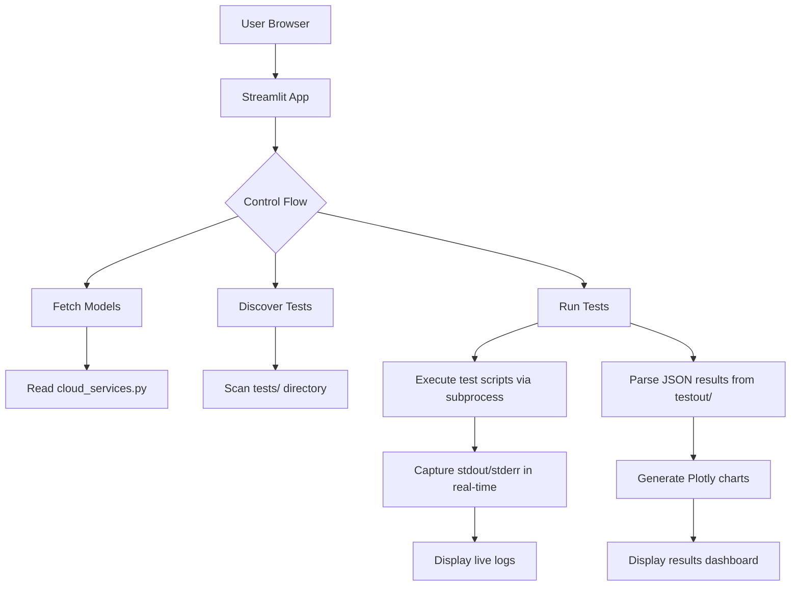

# Design Document: Visual Test Interface

## Overview
This document outlines the technical design for the visual test interface, a standalone web application built with Streamlit. The application will allow users to select LLM models and tests, run evaluations, monitor progress in real-time, and visualize results through interactive charts, all while integrating seamlessly with the existing command-line test suite.

## Architecture
The application follows a simple client-server architecture where the Streamlit app acts as both the server and the UI. It interacts with the existing test suite by executing Python scripts as subprocesses.

## Components and Interfaces

### 1. Model Selector
- **Function**: Fetches and displays the list of available LLM models.
- **Implementation**: Reads the `scripts/utils/cloud_services.py` file, parses the `AVAILABLE_MODELS` dictionary, and extracts the model keys. Displays them in a Streamlit dropdown (`st.selectbox`).
- **Interface**: `get_available_models() -> List[str]`

### 2. Test Selector
- **Function**: Discovers and displays all available tests for user selection.
- **Implementation**: Scans the `tests/` directory for files matching the pattern `test_pillar_*.py`. Groups them into categories based on their pillar number (e.g., 01-08: 基础能力测试). Uses a hierarchical checkbox system (`st.checkbox` with nested columns or a tree-like structure).
- **Interface**: `discover_tests() -> Dict[str, List[str]]`

### 3. Test Runner and Monitor
- **Function**: Executes the selected tests and provides real-time feedback.
- **Implementation**: Uses Python's `subprocess.Popen` to start the test script (e.g., `run_comprehensive_tests.py` or individual `test_pillar_X.py`). Reads the `stdout` and `stderr` streams line by line in real-time using a loop and `proc.stdout.readline()`. Streams each line to a Streamlit text area (`st.text_area` or `st.code` with `scrolling=True`).
- **Interface**: `run_test(script_path: str, args: List[str]) -> Generator[str, None, None]`

### 4. Results Dashboard
- **Function**: Parses and visualizes the test results.
- **Implementation**: After a test run completes, the app locates the most recent JSON result file in the `testout/` directory. Parses the JSON to extract success rates, durations, and other metrics. Uses Plotly to create charts:
    - `plot_success_rate_bar(results)`: Bar chart of success rates per test pillar.
    - `plot_overall_pie(results)`: Pie chart of total pass/fail ratio.
    - `plot_response_time_line(results)`: Line chart of response times (if available).
- **Interface**: `parse_results(result_file: str) -> Dict`, `generate_charts(data: Dict) -> Dict[plotly.graph_objects.Figure]`

## Data Models
The application will use simple Python data structures:
- `TestSuite`: A dictionary with category names as keys and lists of test file names as values.
- `TestResult`: A dictionary representing the parsed JSON structure from the test output files, containing the `test_results` and `summary` fields.

## Error Handling
- **Model/Script Discovery Failure**: Display a clear error message in the UI and provide a "Retry" button.
- **Test Execution Failure**: Capture the subprocess exit code and error output. Display the error in the log panel and prevent the results dashboard from loading.
- **JSON Parsing Failure**: If the result file cannot be parsed, display an error and show the raw JSON content in a code block for debugging.
- **Streamlit Session State**: Use `st.session_state` to manage the state of the running process and prevent UI conflicts.

## Testing Strategy
- **Unit Tests**: Mock the `subprocess` calls and file system interactions to test the `discover_tests` and `parse_results` functions in isolation.
- **Integration Tests**: Manually verify that the Streamlit app can successfully:
    1.  List models and tests.
    2.  Run a test and display live output.
    3.  Parse the generated JSON and display correct charts.
- **Manual Testing**: The primary testing will be manual, ensuring the UI is intuitive and all features work as expected from an end-user perspective.
