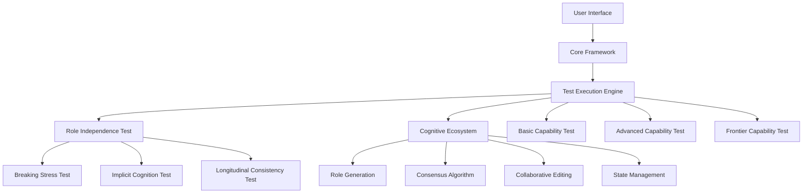
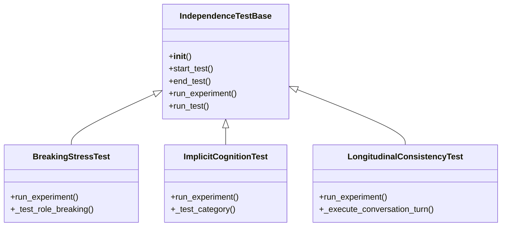
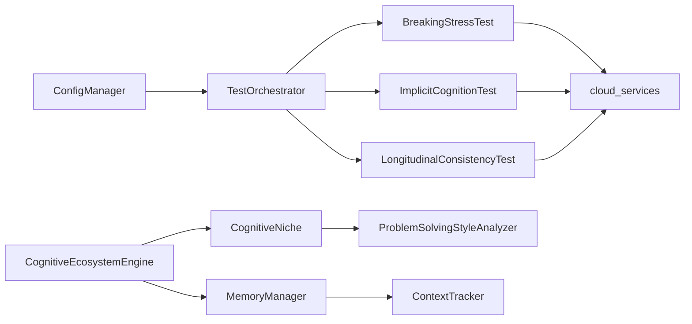
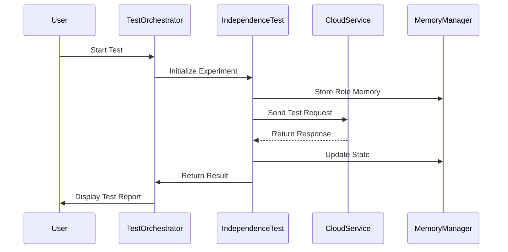

# LLM Advanced Capability Evaluation Suite - Project Architecture Documentation

## 1. Project Overview

This project is a comprehensive LLM advanced capability evaluation framework designed to assess large language models' advanced capabilities in multi-round complex interactions, particularly their potential as a "cognitive engine". The core focus is on the model's ability to handle ultra-long contexts, task decomposition and reorganization, state tracking, active clarification, and tool coordination.

## 2. System Architecture

### 2.1 Overall Architecture



### 2.2 Core Modules

#### 2.2.1 Role Independence Testing System

Evaluates the LLM's ability to maintain role identity consistency in multi-round conversations, containing three core experiments:

**E1: Breaking Stress Test**
- Detects the stability of role belief systems through stress testing
- Measures the model's role retention capability under extreme conditions
- Main class: `BreakingStressTest` (independence/experiments/breaking_stress.py)
- Key methods: `run_experiment`, `_test_role_breaking`

**E2: Implicit Cognition Test**
- Probes the model's deep cognitive structure through implicit prompts
- Analyzes the model's behavior patterns without explicit instructions
- Main class: `ImplicitCognitionTest` (independence/experiments/implicit_cognition.py)
- Key methods: `run_experiment`, `_test_category`

**E3: Longitudinal Consistency Test**
- Tracks the model's role evolution trajectory in long conversations
- Evaluates the persistence of role memory and state
- Main class: `LongitudinalConsistencyTest` (independence/experiments/longitudinal_consistency.py)
- Key methods: `run_experiment`, `_execute_conversation_turn`

#### 2.2.2 Cognitive Ecosystem

Simulates a multi-agent collaborative cognitive ecosystem, including:

**Role Generation**
- Generates roles with different backgrounds, perspectives, and professional domains
- Main class: `CognitiveEcosystemEngine` (cognitive_ecosystem/core/ecosystem_engine.py)
- Key methods: `register_agent`, `simulate_interaction`

**Consensus Algorithm**
- Implements blockchain consensus algorithms such as PoW, PoS, PBFT
- Main class: `ConsensusAnalyzer` (cognitive_ecosystem/analyzers/consensus_analyzer.py)
- Key methods: `analyze_consensus`, `_calculate_consensus_metrics`

**Collaborative Editing**
- Multi-role collaborative editing and conflict resolution
- Main class: `MassiveConsensusTest` (tests/test_pillar_20_massive_consensus.py)
- Key methods: `collaborative_editing_phase`, `voting_mechanism_phase`

**State Management**
- Large-scale role state tracking and management
- Main class: `MemoryManager` (cognitive_ecosystem/core/memory_manager.py)
- Key methods: `store_memory`, `retrieve_memory`, `search_memories`

### 2.3 Core Class Relationships

#### 2.3.1 Inheritance Relationships



#### 2.3.2 Dependency Relationships



### 2.4 Core Interfaces

#### 2.4.1 Configuration Management Interface

```python
class ConfigManager:
    def __init__(self, config_file: str = "config/config.py"):
        pass
        
    def get_available_models(self) -> List[str]:
        """Get available model list"""
        pass
        
    def get_default_model(self) -> str:
        """Get default test model"""
        pass
        
    def get_independence_config(self) -> Dict:
        """Get role independence test configuration"""
        pass
```

#### 2.4.2 Test Execution Interface

```python
class TestOrchestrator:
    def __init__(self, config_manager: ConfigManager):
        pass
        
    def execute_test_suite(self, test_suite: str, model_name: str):
        """Execute test suite"""
        pass
        
    def run_independence_experiment(self, experiment_type: str, model_name: str):
        """Run independence experiment"""
        pass
```

#### 2.4.3 Cloud Service Interface

```python
def call_cloud_service(service_name: str, model_name: str, prompt: str, system_prompt: str = "") -> str:
    """Call cloud service"""
    pass
    
def check_service_connectivity(service_name: str, config: Dict) -> bool:
    """Check service connectivity"""
    pass
```

### 2.5 Data Flow



## 3. Developer Guide

### 3.1 Adding New Tests

1. Create a new test file under the `tests/` directory
2. Inherit from the `IndependenceTestBase` class
3. Implement the `run_experiment` method
4. Register the new test in `main_orchestrator.py`

### 3.2 Extending Cognitive Ecosystem

1. Create a new detector under the `cognitive_ecosystem/detectors/` directory
2. Implement the corresponding analysis methods
3. Register the new component in `cognitive_ecosystem/__init__.py`

### 3.3 Debugging Tips

- Use `debug_model_call.py` to debug model calls
- Use `test_independence_fix.py` to verify fixes
- Check the detailed test output in the `testout/` directory

## 4. Toolchain

### 4.1 Architecture Mapping Tool

The `project_architecture_map.py` script automatically generates project architecture mapping:

```bash
python project_architecture_map.py --output-dir docs/architecture
```

### 4.2 Test Generator

The `enhanced_test_generator.py` script generates test code based on interface mapping:

```bash
python enhanced_test_generator.py --interface-map interface_map.json
```

### 4.3 Result Analysis

The `analyze_results.py` script analyzes test results and generates reports:

```bash
python analyze_results.py --input-dir testout/ --output-dir results/
