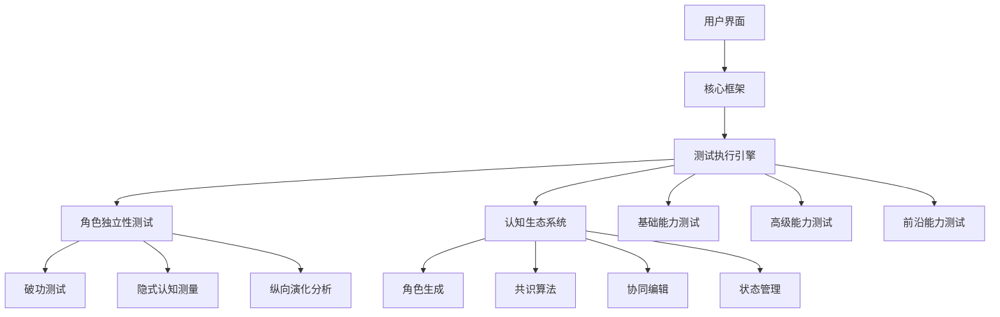
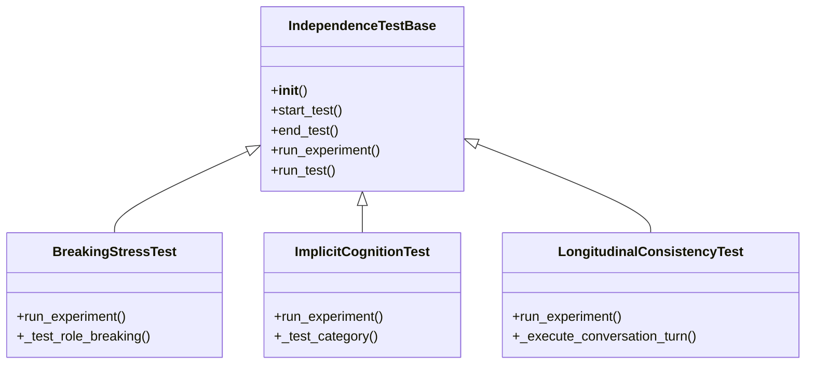
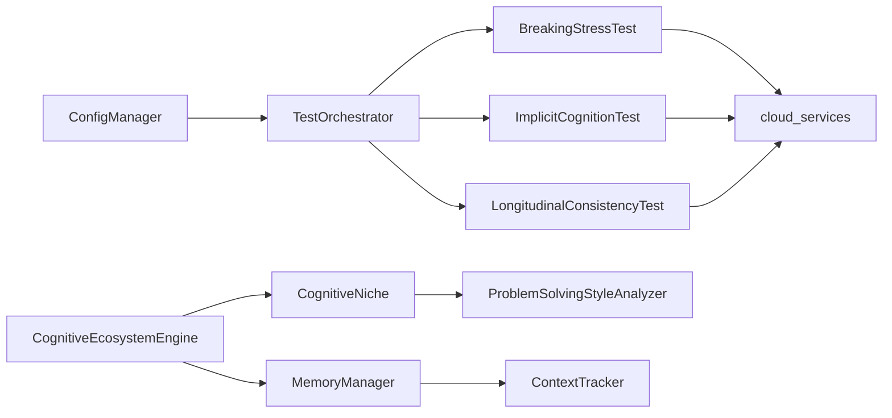
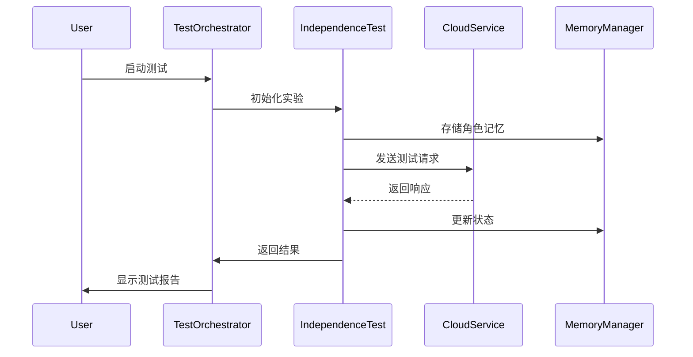

# LLM高级能力测评套件 - 项目总体架构文档

## 1. 项目概述

本项目是一个全面的LLM高级能力测评框架，旨在评估大语言模型在多轮复杂交互中的高级能力，特别是其作为"认知引擎"的潜力。核心关注点在于模型处理超长上下文、任务分解与重组、状态追踪、主动澄清以及工具协同的能力。

## 2. 系统架构

### 2.1 整体架构



### 2.2 核心模块

#### 2.2.1 角色独立性测试系统

评估LLM在多轮对话中保持角色身份一致性的能力，包含三大核心实验：

**E1: 破功测试 (Breaking Stress Test)**
- 通过压力测试检测角色信念体系的稳定性
- 测量模型在极端条件下的角色保持能力
- 主要类：`BreakingStressTest` (independence/experiments/breaking_stress.py)
- 关键方法：`run_experiment`, `_test_role_breaking`

**E2: 隐式认知测量 (Implicit Cognition Test)**
- 通过隐式提示探测模型的深层认知结构
- 分析模型在无明确指令下的行为模式
- 主要类：`ImplicitCognitionTest` (independence/experiments/implicit_cognition.py)
- 关键方法：`run_experiment`, `_test_category`

**E3: 纵向演化分析 (Longitudinal Consistency Test)**
- 追踪模型在长时间对话中的角色演化轨迹
- 评估角色记忆和状态的持续性
- 主要类：`LongitudinalConsistencyTest` (independence/experiments/longitudinal_consistency.py)
- 关键方法：`run_experiment`, `_execute_conversation_turn`

#### 2.2.2 认知生态系统

模拟多智能体协作的认知生态系统，包含：

**角色生成**
- 生成具有不同背景、观点、专业领域的角色
- 主要类：`CognitiveEcosystemEngine` (cognitive_ecosystem/core/ecosystem_engine.py)
- 关键方法：`register_agent`, `simulate_interaction`

**共识算法**
- 实现PoW、PoS、PBFT等区块链共识算法
- 主要类：`ConsensusAnalyzer` (cognitive_ecosystem/analyzers/consensus_analyzer.py)
- 关键方法：`analyze_consensus`, `_calculate_consensus_metrics`

**协同编辑**
- 多角色协作编辑和冲突解决
- 主要类：`MassiveConsensusTest` (tests/test_pillar_20_massive_consensus.py)
- 关键方法：`collaborative_editing_phase`, `voting_mechanism_phase`

**状态管理**
- 大规模角色的状态追踪和管理
- 主要类：`MemoryManager` (cognitive_ecosystem/core/memory_manager.py)
- 关键方法：`store_memory`, `retrieve_memory`, `search_memories`

### 2.3 核心类关系

#### 2.3.1 继承关系



#### 2.3.2 依赖关系



### 2.4 核心接口

#### 2.4.1 配置管理接口

```python
class ConfigManager:
    def __init__(self, config_file: str = "config/config.py"):
        pass
        
    def get_available_models(self) -> List[str]:
        """获取可用模型列表"""
        pass
        
    def get_default_model(self) -> str:
        """获取默认测试模型"""
        pass
        
    def get_independence_config(self) -> Dict:
        """获取角色独立性测试配置"""
        pass
```

#### 2.4.2 测试执行接口

```python
class TestOrchestrator:
    def __init__(self, config_manager: ConfigManager):
        pass
        
    def execute_test_suite(self, test_suite: str, model_name: str):
        """执行测试套件"""
        pass
        
    def run_independence_experiment(self, experiment_type: str, model_name: str):
        """运行独立性实验"""
        pass
```

#### 2.4.3 云服务接口

```python
def call_cloud_service(service_name: str, model_name: str, prompt: str, system_prompt: str = "") -> str:
    """调用云服务"""
    pass
    
def check_service_connectivity(service_name: str, config: Dict) -> bool:
    """检查服务连接性"""
    pass
```

### 2.5 数据流



## 3. 开发者指南

### 3.1 添加新测试

1. 在 `tests/` 目录下创建新的测试文件
2. 继承 `IndependenceTestBase` 类
3. 实现 `run_experiment` 方法
4. 在 `main_orchestrator.py` 中注册新测试

### 3.2 扩展认知生态系统

1. 在 `cognitive_ecosystem/detectors/` 目录下创建新的探测器
2. 实现相应的分析方法
3. 在 `cognitive_ecosystem/__init__.py` 中注册新组件

### 3.3 调试技巧

- 使用 `debug_model_call.py` 调试模型调用
- 使用 `test_independence_fix.py` 验证修复
- 查看 `testout/` 目录下的详细测试输出

## 4. 工具链

### 4.1 架构映射工具

`project_architecture_map.py` 脚本自动生成项目架构映射：

```bash
python project_architecture_map.py --output-dir docs/architecture
```

### 4.2 测试生成器

`enhanced_test_generator.py` 基于接口映射生成测试代码：

```bash
python enhanced_test_generator.py --interface-map interface_map.json
```

### 4.3 结果分析

`analyze_results.py` 分析测试结果并生成报告：

```bash
python analyze_results.py --input-dir testout/ --output-dir results/
